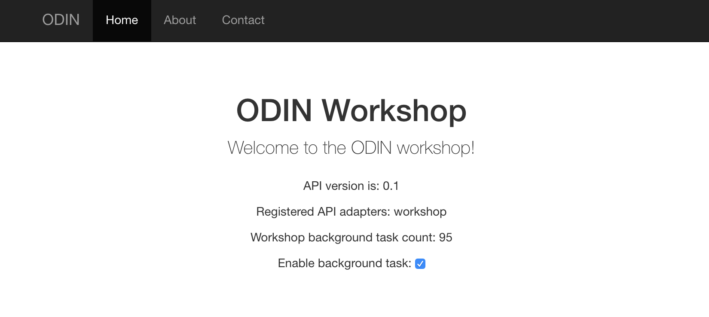

# AEG ODIN control workshop
## 14 November 18

## Table of Contents

* What is odin-control?
* What is tornado?
* Core concepts
  * `odin_control`
  * Adapters
  * Parameter tree
  * API vs static URLs
  * UI layer
* Getting started demo
* Using an external adapter

## What is odin-control?

* Python-based framework for the _**control plane**_ of detector systems 
* based on [tornado](http://www.tornadoweb.org/en/stable/) 
web application framework
* dynamically-loaded plugin _**adapters**_ provide system-specific functionality
* [this](https://accelconf.web.cern.ch/icalepcs2017/papers/tupha212.pdf) published conference paper gives an overview of odin-control
* presents REST-like control API and/or web content using HTTP and JSON:
```
$ curl http://127.0.0.1:8888/api/0.1/excalibur/

[D 180622 16:23:08 server:75] 200 GET /api/0.1/excalibur/ (127.0.0.1) 0.87ms
{u'command': {u'api_trace': False,
              u'connect': None,
              u'fe_init': None,
              u'fe_param_read': {u'chip': 0,
                                 u'fem': 0,
                                 u'param': [u'frames_acquired',
                                            u'control_state'],
                                 u'value': {u'control_state': [1073741855],
                                            u'efuseid': [[2788134078,
                                                          3979316414,
                                                          3962539198,
                                                          321883326,
                                                          3601829054,
                                                          2393870014,
                                                          347049662,
                                                          1588563646]],
                                            u'frames_acquired': [100]}},
              u'fem_reboot': None,
              u'load_dacconfig': None,
              u'load_pixelconfig': None,
              u'reset_udp_counter': None,
              u'start_acquisition': None,
              u'stop_acquisition': None},
 u'status': {u'command_pending': False,
             u'command_succeeded': True,
             u'connected': True,
             u'fem': [{u'address': u'192.168.0.106',
                       u'chip_enable_mask': 255,
                       u'chips_enabled': [1, 2, 3, 4, 5, 6, 7, 8],
                       u'data_address': u'10.0.2.1',
                       u'error_code': 0,
                       u'error_msg': u'',
                       u'id': 1,
                       u'port': 6969,
                       u'state': 1}],
             u'num_pending': 0,
             u'powercard_fem_idx': 0}}
```


## What is tornado?

* [www.tornadoweb.org](http://www.tornadoweb.org/en/stable/)
* Written in Python 
* Web application framework and asynchronous networking library
* Originally developed at FriendFeed (aka Facebook)
* Makes use of non-blocking network I/O
* Supports large number of open client connections from single application thread

## Core Concepts

### `odin-control`

* the _installed_ application in `odin-control`
* a wrapper around a tornado HTTP server instance running on a defined IP address/port
* responsible for loading and configuring one or more _adapters_ to control elements of a system
* expose REST-like interface to adapters via a well-known API URL
* able to optionally serve static assets, e.g. HTML, CSS, JS to generate a control UI in a 
web browser

### Adapters

* do the heavy lifting in `odin-control`
* are python modules dynamically loaded into a running `odin_control` instance
* do _not_ need to be part of odin-control package
* transform incoming HTTP requests (GET and PUT) into actions
* expose a tree of parameter resources with read and/or write access via the REST API
* typically expose JSON access to parameter resources
* interface to hardware, other systems, compiled libraries, etc.
* can run background update tasks on a timer (e.g hardware update polling loop)
* are the bit you'll write!

**NB** : adapters should ensure GET requests are idempotent, i.e. do **not** affect state of system.
If you need to modify a parameter, trigger an command, launch a acquisition etc., 
**you MUST use a PUT request**

### Parameter tree

* a `dict`-like class used in adapters to define a tree of parameters
* allow recursive read/write access at arbitrary points in the tree
* bind set/get (i.e. read/write) methods to leaves on the tree
* can be nested (see later example)

### API vs static URLs 

* API access:
    * Adapters are bound into URL 'routes' in the HTTP server
    * Are accessed via a single, versioned top-level API URL, 
    e.g `http://127.0.0.1:8888/api/0.1/<adapter_name>/`
    * Can handle at least GET and PUT requests (+ optionally DELETE)

* Static URLs:
    * Server can also serve static assets from `static_path`: HTML, JS, CSS etc
    * Exposed at the upper-most URL of the server, e.g. `http://127.0.0.1/index.html`
    * Not required but used on e.g. LPD PSCU, QEM, PERCIVAL, ...

### UI layer

* not required if e.g another control system is accessing API
* typically has small number of HTML pages, with CSS and Javascript assets loaded
* interacts with API via AJAX requests
* **MUST** separate presentation from business logic (a la MVC pattern) - don't implement any control
logic on UI side, do it in the adapter
* Examples to date (LPD, QEM, PERCIVAL, ...) use JQuery / Bootstrap libraries

## Getting started demo

* For this demo you will need to have Python 3.5 or later installed on your machine as Tornado 6 does not work with earlier versions.

* Create a python >= 3.5 virtual environment in a directory of your choice (various methods):

Execute command:
```
$ virtualenv odin-workshop-3.9
```

Terminal output:
```
created virtual environment CPython3.9.final.0-64 in 2470ms
  creator CPython3Posix(dest=/u/user/odin-workshop/odin-workshop-3.9, clear=False, global=False)
  seeder FromAppData(download=False, pip=latest, setuptools=latest, wheel=latest, via=copy, app_data_dir=/u/user/.local/share/virtualenv/seed-app-data/v1.0.1)
  activators BashActivator,CShellActivator,FishActivator,PowerShellActivator,PythonActivator,XonshActivator
```

To activate this virtual environment, execute command:
```
$ source odin-workshop-3.9/bin/activate
```

* Clone `odin-control` from GitHub:

Execute command:
```
$ git clone https://github.com/odin-detector/odin-control.git
```

Terminal output:

```
Cloning into 'odin-control'...
remote: Enumerating objects: 121, done.
remote: Counting objects: 100% (121/121), done.
remote: Compressing objects: 100% (59/59), done.
remote: Total 2057 (delta 53), reused 106 (delta 47), pack-reused 1936
Receiving objects: 100% (2057/2057), 704.91 KiB | 0 bytes/s, done.
Resolving deltas: 100% (1255/1255), done.
```

* Install `odin-control` in develop mode (make sure the virtual environment is activated):

* Using the pip command installs everything available that is not currently installed

Execute commands:
```
$ cd odin-control
```

```
$ pip install -e .
```

Terminal output (may not be identical to this):
```
Obtaining file:///aeg_sw ... ... /odin-control
Preparing metadata (setup.py) ... done
Collecting future (from odin-control==1.4.0)
  Downloading future-0.18.3.tar.gz (840 kB)
  Preparing metadata (setup.py) ... done
Collecting pyzmq>=17.1.0 (from odin-control==1.4.0)
  Obtaining dependency information for pyzmq>=17.1.0 from https://files.pythonhosted.org/packages/a2/e0/086 ... ... .metadata
  Downloading pyzmq-25.1.1-cp39-cp39-manylinux_2_12_x86_64.manylinux2010_x86_64.whl.metadata (4.9 kB)
Collecting tornado>=4.3 (from odin-control==1.4.0)
  Obtaining dependency information for tornado>=4.3 from https://files.pythonhosted.org/packages/66/a5/e6d ... ... .metadata
  Downloading tornado-6.3.3-cp38-abi3-manylinux_2_5_x86_64.manylinux1_x86_64 ... ... whl.metadata (2.5 kB)
Collecting psutil>=5.0 (from odin-control==1.4.0)
  Downloading psutil-5.9.5-cp36-abi3-manylinux_2_12_x86_64.manylinux2010_x86_64. ... ... manylinux2014_x86_64.whl (282 kB)
     ━━━━━━━━━━━━━━━━━━━━━━━━━━━━━━━━━━━━━━━━ 282.1/282.1 kB 19.3 MB/s eta 0:00:00
Downloading pyzmq-25.1.1-cp39-cp39-manylinux_2_12_x86_64.manylinux2010_x86_64.whl (1.1 MB)
   ━━━━━━━━━━━━━━━━━━━━━━━━━━━━━━━━━━━━━━━━ 1.1/1.1 MB 25.2 MB/s eta 0:00:00
Downloading tornado-6.3.3-cp38-abi3-manylinux_2_5_x86_64.manylinux1_x86_64.manylinux_2_17_x86_64.manylinux2014_x86_64.whl (427 kB)
   ━━━━━━━━━━━━━━━━━━━━━━━━━━━━━━━━━━━━━━━━ 427.7/427.7 kB 21.1 MB/s eta 0:00:00
Building wheels for collected packages: future
  Building wheel for future (setup.py) ... done
  Created wheel for future: filename=future-0.18.3-py3-none-any.whl size=492024 sha256=2a61a9220d ... ... f22
  Stored in directory: /u/mux12756/.cache/pip/wheels/bf/5d/6a/2e53874f7ec4e2bede522385439531fafec8fafe005b5c3d1b
Successfully built future
Installing collected packages: tornado, pyzmq, psutil, future, odin-control
  Running setup.py develop for odin-control
Successfully installed future-0.18.3 odin-control-1.4.0 psutil-5.9.5 pyzmq-25.1.1 tornado-6.3.3
```

* Behold the glory that is `odin_control`:

Execute command:
```
$ which odin_control
```

Terminal output:
```
/u/user/odin-workshop/odin-workshop-3.8.3/bin/odin_control
```

Execute command:
```
$ odin_control --help
```

Terminal output:
```
usage: odin_control [-h] [--version] [--config FILE] [--adapters ADAPTERS]
                   [--http_addr HTTP_ADDR] [--http_port HTTP_PORT]
                   [--debug_mode DEBUG_MODE]
                   [--access_logging debug|info|warning|error|none]
                   [--static_path STATIC_PATH]
                   [--log_file_max_size LOG_FILE_MAX_SIZE]
                   [--log_file_num_backups LOG_FILE_NUM_BACKUPS]
                   [--log_file_prefix PATH]
                   [--log_rotate_interval LOG_ROTATE_INTERVAL]
                   [--log_rotate_mode LOG_ROTATE_MODE]
                   [--log_rotate_when LOG_ROTATE_WHEN]
                   [--log_to_stderr LOG_TO_STDERR]
                   [--logging debug|info|warning|error|none]

optional arguments:
  -h, --help            show this help message and exit
  --version             Show the server version information and exit
  --config FILE         Specify a configuration file to parse
  --adapters ADAPTERS   Comma-separated list of API adapters to load
  --http_addr HTTP_ADDR
                        Set HTTP server address
  --http_port HTTP_PORT
                        Set HTTP server port
  --debug_mode DEBUG_MODE
                        Enable tornado debug mode
  --access_logging debug|info|warning|error|none
                        Set the tornado access log level
  --static_path STATIC_PATH
                        Set path for static file content
  --log_file_max_size LOG_FILE_MAX_SIZE
                        max size of log files before rollover
  --log_file_num_backups LOG_FILE_NUM_BACKUPS
                        number of log files to keep
  --log_file_prefix PATH
                        Path prefix for log files. Note that if you are
                        running multiple tornado processes, log_file_prefix
                        must be different for each of them (e.g. include the
                        port number)
  --log_rotate_interval LOG_ROTATE_INTERVAL
                        The interval value of timed rotating
  --log_rotate_mode LOG_ROTATE_MODE
                        The mode of rotating files(time or size)
  --log_rotate_when LOG_ROTATE_WHEN
                        specify the type of TimedRotatingFileHandler interval
                        other options:('S', 'M', 'H', 'D', 'W0'-'W6')
  --log_to_stderr LOG_TO_STDERR
                        Send log output to stderr (colorized if possible). By
                        default use stderr if --log_file_prefix is not set and
                        no other logging is configured.
  --logging debug|info|warning|error|none
                        Set the Python log level. If 'none', tornado won't
                        touch the logging configuration.
``` 

* Go to `odin-control/tests/config` and use `nano test.cfg` to modify the `test.cfg` file:

* Change the value of `http_addr` to `127.0.0.1` and then use `Ctrl + O` to save and `Ctrl + X` to exit the file:

* Start `odin_control` with a demo adapter and UI:

Execute commands:
```
$ cd tests
```

```
$ odin_control --config config/test.cfg --logging=debug --debug_mode=1
```

Terminal output (may not be identical to this):
```
[D 200715 15:57:39 dummy:47] Launching background task with interval 1.00 secs
[D 200715 15:57:39 selector_events:59] Using selector: EpollSelector
[D 200715 15:57:39 dummy:55] DummyAdapter loaded
[D 200715 15:57:39 api:230] Registered API adapter class DummyAdapter from module odin.adapters.dummy for path dummy
[D 230918 13:54:14 dummy:56] DummyAdapter initialized with 1 adapters
[D 200715 15:57:39 default:40] Static path for default handler is ./static
[I 200715 15:57:39 server:63] HTTP server listening on 127.0.0.1:8888
[D 200715 15:57:40 dummy:65] DummyAdapter: background task running, count = 0
[D 200715 15:57:41 dummy:65] DummyAdapter: background task running, count = 1
[D 200715 15:57:42 dummy:65] DummyAdapter: background task running, count = 2
```

* Browse to the default UI:


* For the next section, you will need to install HTTPie, done with the following command (make sure the virtual environment is activated):
```
$ pip install httpie
```
* HTTPie is designed for testing, debugging and interacting with APIs and HTTP servers:

* Interrogate the REST API:

Execute command:
```
$ http http://127.0.0.1:8888/api
```

Terminal output:
```
{
    "api" : 0.1
}
```

Execute command:
```
$ http http://127.0.0.1:8888/api/0.1/adapters
```

Terminal output:
```
{
    "adapters": [
        "dummy"
    ]
}
```

Execute command:
```
$ http http://127.0.0.1:8888/api/0.1/dummy
```

Terminal output:
```
{
    "response": "DummyAdapter: GET on path "
}
```

Execute command:
```
$ http http://127.0.0.1:8888/api/0.1/dummy/random_path
```

Terminal output:
```
{
    "response": "DummyAdapter: GET on path random_path"
}
```

Execute command:
```
$ http PUT http:/127.0.0.1:8888/api/0.1/dummy/test_put
```

Terminal output:
```
{
    "response": "DummyAdapter: PUT on path test_put"
}
```

* Try a different adapter:

Execute command:
```
$ odin_control --config config/test_system_info.cfg
```

Terminal output (may not be identical to this):
```
[D 181113 15:46:00 system_info:36] SystemInfoAdapter loaded
[D 181113 15:46:00 api:229] Registered API adapter class SystemInfoAdapter from module odin.adapters.system_info for path system_info
[D 181113 15:46:00 default:40] Static path for default handler is static
[D 230918 14:29:34 selector_events:59] Using selector: EpollSelector
[I 181113 15:46:00 server:72] HTTP server listening on 127.0.0.1:8888
```

* `system_info` uses nested `ParameterTree` instances for API variables:

Execute command:
```
$ http http:/127.0.0.1:8888/api/0.1/system_info
```

Terminal output:
```
{
    "odin_version": "1.4.0+0.gc714065.dirty",
    "platform": {
        "node": "te7aegnode01.te.rl.ac.uk",
        "processor": "x86_64",
        "release": "3.10.0-1160.95.1.el7.x86_64",
        "system": "Linux",
        "version": "#1 SMP Mon Jul 24 13:59:37 UTC 2023"
    },
    "python_version": "3.9.4",
    "server_uptime": 108.39563751220703,
    "tornado_version": "6.3.3"
}
```

## Using an external adapter

* There is a demo external adapter included within this repo
* First clone this repo somehwere (alongside `odin-control` above would be fine):

Execute command:
```
$ git clone https://github.com/stfc-aeg/odin-workshop.git
```

Terminal output:
```
Cloning into 'odin-workshop'...
remote: Enumerating objects: 178, done.
remote: Counting objects: 100% (31/31), done.
remote: Compressing objects: 100% (25/25), done.
remote: Total 178 (delta 10), reused 17 (delta 5), pack-reused 147
Receiving objects: 100% (178/178), 1.21 MiB | 0 bytes/s, done.
Resolving deltas: 100% (71/71), done.
```

Execute commands:
```
$ cd odin-workshop/python
```

```
$ tree -d
```

Terminal output:
```
.
├── test
│   ├── config
│   └── static
│       ├── css
│       └── js
│           └── bootstrap-3.3.6-dist
│               ├── css
│               ├── fonts
│               └── js
└── workshop

10 directories
```
* Contains an installable python module `workshop` containing an adapter, plus a config file and
static resources to demonstrate web interaction.

* Install it, using the pip command we used earlier:

Execute command:
```
$ pip install -e .
```

Terminal output:
```
Obtaining file:///aeg_sw/work/users/mux12756/develop/projects/odin_workshop/odin-workshop/python
  Preparing metadata (setup.py) ... done
Installing collected packages: workshop
  Running setup.py develop for workshop
Successfully installed workshop-0+untagged.35.gde8626e
```

* Run `odin_control` with the appropriate config:

Execute command:
```
$ odin_control --config test/config/workshop.cfg
```

Terminal output: 
```
[D 200715 16:15:22 adapter:231] Launching background tasks with interval 1.00 secs
[D 200715 16:15:22 selector_events:59] Using selector: EpollSelector
[D 200715 16:15:22 adapter:45] WorkshopAdapter loaded
[D 200715 16:15:22 api:230] Registered API adapter class WorkshopAdapter from module workshop.adapter for path workshop
[D 200715 16:15:22 system_info:37] SystemInfoAdapter loaded
[D 200715 16:15:22 api:230] Registered API adapter class SystemInfoAdapter from module odin.adapters.system_info for path system_info
[D 200715 16:15:22 default:40] Static path for default handler is test/static
[I 200715 16:15:22 server:63] HTTP server listening on 127.0.0.1:8888
[D 200715 16:15:23 adapter:259] Background IOLoop task running, count = 0
[D 200715 16:15:23 adapter:278] Background thread task running, count = 0
[D 200715 16:15:24 adapter:259] Background IOLoop task running, count = 1
...
```

* Interact with the adapter at the command line:

Execute command:
```
$ http http://127.0.0.1:8888/api/0.1/workshop
```

Terminal output
```
{
    "background_task": {
        "enable": true,
        "interval": 1.0,
        "ioloop_count": 45,
        "thread_count": 45
    },
    "odin_version": "1.4.0+0.gc714065.dirty",
    "server_uptime": 45.50046396255493,
    "tornado_version": "6.3.3"
}
```

Execute command:
```
$ http PUT http://127.0.0.1:8888/api/0.1/workshop/background_task enable:=false
```

Terminal output
```
{
    "background_task": {
        "enable": false,
        "interval": 1.0,
        "ioloop_count": 302,
        "thread_count": 301
    }
}
```

Execute command:
```
$ http PUT http://127.0.0.1:8888/api/0.1/workshop/background_task inteval:=0.1
```

Terminal output
```
{
    "background_task": {
        "enable": false,
        "interval": 0.1,
        "ioloop_count": 302,
        "thread_count": 302
    }
}
```

* Try the demo UI in a browser:



* Explore the code in `workshop\adapter.py`. 
* Demonstrates the following:
    * Initialization with parameters from config file
    * Handling GET/PUT
    * Passing off get/set to Workshop class
    * Use of nested parameter trees
    * Read-only and read/write methods on parameters
    * Background task in thread executor pool

* Explore the static resources `index.html` and `odin_control.js`:

    * UI interaction using HTML and JS
    * Background polling in JS to keep adapter state view refreshed
  
## Questions ??
