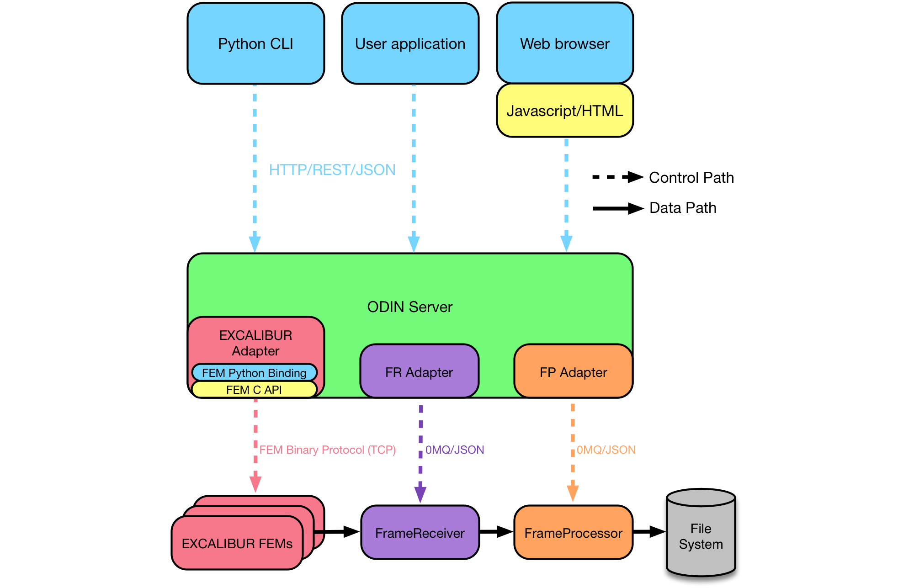
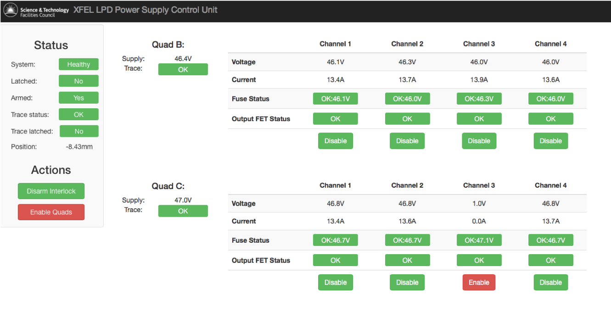
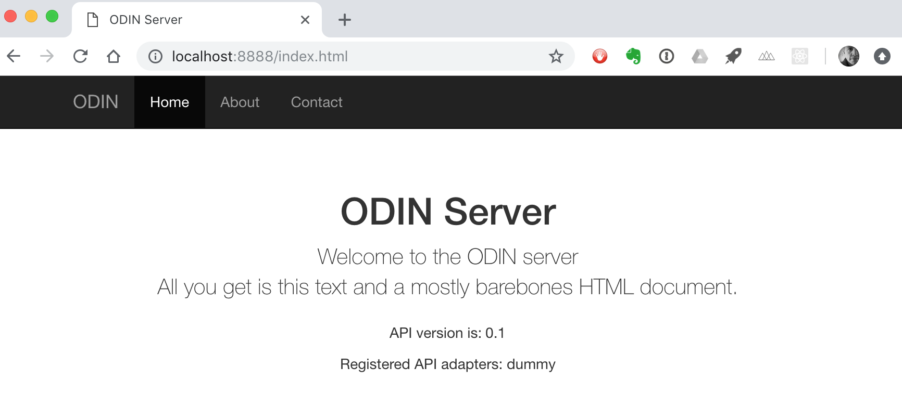

# AEG ODIN control workshop
## 14 November 18

## Table of Contents

* What is odin-control?
* What is tornado?
* Core concepts
  * `odin_server`
  * Adapters
  * Parameter tree
  * API vs static URLs
  * UI layer
* Getting started demo

## What is odin-control?

* Python-based framework for the _**control plane**_ of detector systems
* based on [tornado](http://www.tornadoweb.org/en/stable/) 
web application framework
* dynamically-loaded plugin _**adapters**_ provide system-specific functionality
* presents REST-like control API and/or web content using HTTP and JSON:
```
$ curl http://127.0.0.1:8888/api/0.1/excalibur/

[D 180622 16:23:08 server:75] 200 GET /api/0.1/excalibur/ (127.0.0.1) 0.87ms
{u'command': {u'api_trace': False,
              u'connect': None,
              u'fe_init': None,
              u'fe_param_read': {u'chip': 0,
                                 u'fem': 0,
                                 u'param': [u'frames_acquired',
                                            u'control_state'],
                                 u'value': {u'control_state': [1073741855],
                                            u'efuseid': [[2788134078,
                                                          3979316414,
                                                          3962539198,
                                                          321883326,
                                                          3601829054,
                                                          2393870014,
                                                          347049662,
                                                          1588563646]],
                                            u'frames_acquired': [100]}},
              u'fem_reboot': None,
              u'load_dacconfig': None,
              u'load_pixelconfig': None,
              u'reset_udp_counter': None,
              u'start_acquisition': None,
              u'stop_acquisition': None},
 u'status': {u'command_pending': False,
             u'command_succeeded': True,
             u'connected': True,
             u'fem': [{u'address': u'192.168.0.106',
                       u'chip_enable_mask': 255,
                       u'chips_enabled': [1, 2, 3, 4, 5, 6, 7, 8],
                       u'data_address': u'10.0.2.1',
                       u'error_code': 0,
                       u'error_msg': u'',
                       u'id': 1,
                       u'port': 6969,
                       u'state': 1}],
             u'num_pending': 0,
             u'powercard_fem_idx': 0}}
```






## What is tornado?

* [www.tornadoweb.org](http://www.tornadoweb.org/en/stable/)
* Written in Python 
* Web application framework and asynchronous networking library
* Originally developed at FriendFeed (aka Facebook)
* Makes use of non-blocking network I/O
* Supports large number of open client connections from single application thread

## Core Concepts

### `odin-server`

* the _installed_ application in `odin-control`
* a wrapper around a tornado HTTP server instance running on a defined IP address/port
* responsible for loading and configuring one or more _adapters_ to control elements of a system
* expose REST-like interface to adapters via a well-known API URL
* able to optionally serve static assets, e.g. HTML, CSS, JS to generate a control UI in a 
web browser

### Adapters

* do the heavy lifting in `odin-control`
* are python modules dynamically loaded into a running `odin_server` instance
* do not need to be part of odin-control package
* transform incoming HTTP requests (GET and PUT) into actions
* expose a tree of parameter resources with read and/or write access via the REST API
* typically expose JSON access to parameter resources
* interface to hardware, other systems, compiled libraries, etc.
* can run background update tasks on a timer (e.g hardware update polling loop)
* are the bit you'll write!

**NB** : adapters should ensure GET requests are idempotent, i.e. do **not** affect state of system.
If you need to modify a parameter, trigger an command, launch a acquisition etc., 
**you MUST use a PUT request**

### Parameter tree

* a `dict`-like class used in adapters to define a tree of parameters
* allow recursive read/write access at arbitrary points in the tree
* bind set/get (i.e. read/write) methods to leaves on the tree
* can be nested (see later example)

### API vs static URLs 

* API access:
    * Adapters are bound into URL 'routes' in the HTTP server
    * Are accessed via a single, versioned top-level API URL, 
    e.g `http://127.0.0.1:8888/api/0.1/<adapter_name>/`
    * Can handle at least GET and PUT requests (+ optionally DELETE)

* Static URLs:
    * Server can also serve static assets from `static_path`: HTML, JS, CSS etc
    * Exposed at the upper-most URL of the server, e.g. `http://127.0.0.1/index.html`
    * Not required but used on e.g. LPD PSCU, QEM, PERCIVAL, ...

### UI layer

* not required if e.g another control system is accessing API
* typically has small number of HTML pages, with CSS and Javascript assets loaded
* interacts with API via AJAX requests
* **MUST** separate presentation from business logic (a la MVC pattern) - don't implement any control
logic on UI side, do it in the adapter
* Examples to date (LPD, QEM, PERCIVAL, ...) use JQuery / Bootstrap libraries

## Getting started demo

* Create a python 2.7 virtual environment (various methods):
```
$ mkvirtualenv -p /usr/local/bin/python2.7 odin-workshop-2.7
Running virtualenv with interpreter /usr/local/bin/python2.7
New python executable in /Users/tcn/.virtualenvs/odin-workshop-2.7/bin/python2.7
Also creating executable in /Users/tcn/.virtualenvs/odin-workshop-2.7/bin/python
Installing setuptools, pip, wheel...done.
virtualenvwrapper.user_scripts creating /Users/tcn/.virtualenvs/odin-workshop-2.7/bin/predeactivate
virtualenvwrapper.user_scripts creating /Users/tcn/.virtualenvs/odin-workshop-2.7/bin/postdeactivate
virtualenvwrapper.user_scripts creating /Users/tcn/.virtualenvs/odin-workshop-2.7/bin/preactivate
virtualenvwrapper.user_scripts creating /Users/tcn/.virtualenvs/odin-workshop-2.7/bin/postactivate
virtualenvwrapper.user_scripts creating /Users/tcn/.virtualenvs/odin-workshop-2.7/bin/get_env_details
```

* Clone `odin-control` from GitHub:
```
$ git clone git@github.com:odin-detector/odin-control.git
Cloning into 'odin-control'...
remote: Enumerating objects: 1150, done.
Receiving objects: 100% (1150/1150), 527.84 KiB | 1.38 MiB/s, done.
Resolving deltas: 100% (597/597), done.

$ cd odin-control
```

* Install `odin-control` in develop mode:
```
$ python setup.py develop
running develop
running egg_info
creating odin.egg-info
writing requirements to odin.egg-info/requires.txt
writing odin.egg-info/PKG-INFO
writing top-level names to odin.egg-info/top_level.txt
writing dependency_links to odin.egg-info/dependency_links.txt
writing entry points to odin.egg-info/entry_points.txt
writing manifest file 'odin.egg-info/SOURCES.txt'
reading manifest file 'odin.egg-info/SOURCES.txt'
reading manifest template 'MANIFEST.in'
writing manifest file 'odin.egg-info/SOURCES.txt'
running build_ext
Creating /Users/tcn/.virtualenvs/odin-workshop-2.7/lib/python2.7/site-packages/odin.egg-link (link to .)
Adding odin 0.3.1+3.g8bcfc08 to easy-install.pth file
Installing odin_server script to /Users/tcn/.virtualenvs/odin-workshop-2.7/bin

<< ... snip ... >>

Installed /Users/tcn/.virtualenvs/odin-workshop-2.7/lib/python2.7/site-packages/six-1.11.0-py2.7.egg
Finished processing dependencies for odin==0.3.1+3.g8bcfc08
```

* Behold the glory that is `odin_server`:
```
$ which odin_server
/Users/tcn/.virtualenvs/odin-workshop-2.7/bin/odin_server

$ odin_server --help
usage: odin_server [-h] [--version] [--config FILE] [--adapters ADAPTERS]
                   [--http_addr HTTP_ADDR] [--http_port HTTP_PORT]
                   [--debug_mode DEBUG_MODE]
                   [--access_logging debug|info|warning|error|none]
                   [--static_path STATIC_PATH]
                   [--log_file_max_size LOG_FILE_MAX_SIZE]
                   [--log_file_num_backups LOG_FILE_NUM_BACKUPS]
                   [--log_file_prefix PATH]
                   [--log_rotate_interval LOG_ROTATE_INTERVAL]
                   [--log_rotate_mode LOG_ROTATE_MODE]
                   [--log_rotate_when LOG_ROTATE_WHEN]
                   [--log_to_stderr LOG_TO_STDERR]
                   [--logging debug|info|warning|error|none]

optional arguments:
  -h, --help            show this help message and exit
  --version             Show the server version information and exit
  --config FILE         Specify a configuration file to parse
  --adapters ADAPTERS   Comma-separated list of API adapters to load
  --http_addr HTTP_ADDR
                        Set HTTP server address
  --http_port HTTP_PORT
                        Set HTTP server port
  --debug_mode DEBUG_MODE
                        Enable tornado debug mode
  --access_logging debug|info|warning|error|none
                        Set the tornado access log level
  --static_path STATIC_PATH
                        Set path for static file content
  --log_file_max_size LOG_FILE_MAX_SIZE
                        max size of log files before rollover
  --log_file_num_backups LOG_FILE_NUM_BACKUPS
                        number of log files to keep
  --log_file_prefix PATH
                        Path prefix for log files. Note that if you are
                        running multiple tornado processes, log_file_prefix
                        must be different for each of them (e.g. include the
                        port number)
  --log_rotate_interval LOG_ROTATE_INTERVAL
                        The interval value of timed rotating
  --log_rotate_mode LOG_ROTATE_MODE
                        The mode of rotating files(time or size)
  --log_rotate_when LOG_ROTATE_WHEN
                        specify the type of TimedRotatingFileHandler interval
                        other options:('S', 'M', 'H', 'D', 'W0'-'W6')
  --log_to_stderr LOG_TO_STDERR
                        Send log output to stderr (colorized if possible). By
                        default use stderr if --log_file_prefix is not set and
                        no other logging is configured.
  --logging debug|info|warning|error|none
                        Set the Python log level. If 'none', tornado won't
                        touch the logging configuration.
``` 

* Modify a simple configuration file (change `http_addr` to `127.0.0.1`):
```
$ cd odin/testing
$ cat  config/test.cfg
[server]
debug_mode = 1
http_port  = 8888
http_addr  = 0.0.0.0
static_path = ./static
adapters   = dummy

[tornado]
logging = debug

[adapter.dummy]
module = odin.adapters.dummy.DummyAdapter
background_task_enable = 1
background_task_interval = 1.0
```

* Start `odin_server` with a demo adapter and UI:
```
$ odin_server --config config/test.cfg --logging=debug --debug_mode=1
[I 181113 15:24:54 server:65] Using the 0MQ IOLoop instance
[D 181113 15:24:54 dummy:46] Launching background task with interval 1.00 secs
[D 181113 15:24:54 dummy:61] DummyAdapter: background task running
[D 181113 15:24:54 dummy:50] DummyAdapter loaded
[D 181113 15:24:54 api:229] Registered API adapter class DummyAdapter from module odin.adapters.dummy for path dummy
[D 181113 15:24:54 default:40] Static path for default handler is ./static
[I 181113 15:24:54 server:72] HTTP server listening on 127.0.0.1:8888
[D 181113 15:24:55 dummy:61] DummyAdapter: background task running
[D 181113 15:24:56 dummy:61] DummyAdapter: background task running
[D 181113 15:24:57 dummy:61] DummyAdapter: background task running
```

* Browse to the default UI:



* Interrogate the REST API:

```
$ curl -s http://127.0.0.1:8888/api | python -m json.tool
{
    "api_version": 0.1
}

$ curl -s http://127.0.0.1:8888/api/0.1/adapters | python -m json.tool
{
    "adapters": [
        "dummy"
    ]
}

$ curl -s http://127.0.0.1:8888/api/0.1/dummy/ | python -m json.tool
{
    "response": "DummyAdapter: GET on path "
}

$ curl -s http://127.0.0.1:8888/api/0.1/dummy/random_path | python -m json.tool
{
    "response": "DummyAdapter: GET on path random_path"
}

$ curl -s -H "Content-Type: application/json" -X PUT -d '' 'http://localhost:8888/api/0.1/dummy/test_put' | python -m json.tool
{
    "response": "DummyAdapter: PUT on path test_put"
}
```

* Try a different adapter:

```
$ cat config/test_system_info.cfg
[server]
debug_mode = 1
http_port  = 8888
http_addr  = 127.0.0.1
static_path = static
adapters   = system_info

[tornado]
logging = debug

[adapter.system_info]
module = odin.adapters.system_info.SystemInfoAdapter

$ odin_server --config config/test_system_info.cfg
[I 181113 15:46:00 server:65] Using the 0MQ IOLoop instance
[D 181113 15:46:00 system_info:36] SystemInfoAdapter loaded
[D 181113 15:46:00 api:229] Registered API adapter class SystemInfoAdapter from module odin.adapters.system_info for path system_info
[D 181113 15:46:00 default:40] Static path for default handler is static
[I 181113 15:46:00 server:72] HTTP server listening on 127.0.0.1:8888
[D 181113 15:46:22 server:87] 200 GET /api/0.1/adapters (127.0.0.1) 1.47ms
[D 181113 15:46:32 system_info:55] {'odin_version': '0.3.1+3.g8bcfc08.dirty', 'platform': {'node': 'te7bramley.te.rl.ac.uk', 'release': '18.2.0', 'version': 'Darwin Kernel Version 18.2.0: Fri Oct  5 19:41:49 PDT 2018; root:xnu-4903.221.2~2/RELEASE_X86_64', 'system': 'Darwin', 'processor': 'i386'}, 'server_uptime': 32.154356956481934, 'tornado_version': '4.5.3'}
[D 181113 15:46:32 server:87] 200 GET /api/0.1/system_info/ (127.0.0.1) 0.93ms
```

* `system_info` uses nested `ParameterTree` instances for API variables:
```
  curl -s http://127.0.0.1:8888/api/0.1/system_info/ | python -m json.tool
{
    "odin_version": "0.3.1+3.g8bcfc08.dirty",
    "platform": {
        "node": "te7bramley.te.rl.ac.uk",
        "processor": "i386",
        "release": "18.2.0",
        "system": "Darwin",
        "version": "Darwin Kernel Version 18.2.0: Fri Oct  5 19:41:49 PDT 2018; root:xnu-4903.221.2~2/RELEASE_X86_64"
    },
    "server_uptime": 32.154356956481934,
    "tornado_version": "4.5.3"
}
```