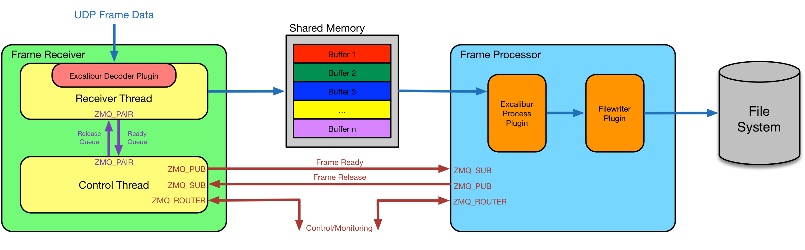
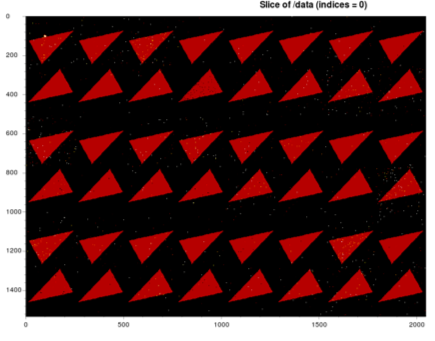

# AEG ODIN data workshop
## 25 June 18

# Table of Contents

* odin-data
  * Frame Receiver
  * Frame Processor
  * Shared Buffers
  * External Software Dependencies
* Demo using EXCALIBUR as example
  * Building odin-data and plugins
  * Create development environment
  * Clone, build and install odin-data
  * Clone, build and install project-specific plugins
  * Install Project-specific Frame Processor Configuration
  * Edit Frame Receiver Configuration
  * Install Excalibur Packet Capture File
* Further discussion topics

## odin-data

* `odin-data` is the _**data plane**_ component of ODIN-based systems
* provides a high-performance, scalable data capture and processing chain
* designed (primarily) for systems sending data as _frames_ over 10GigE+ network links
* consists of two communicating processes:
  * **frame receiver**
  * **frame processor**
* generic applications written in C++ with dynamically-loaded plugins for specific detectors
* both have integrated IPC ZeroMQ channels to allow control/monitoring
* can be integrated with `odin-control`



### Frame Receiver

* does what is says on the tin! :+1:
* captures incoming data (UDP, TCP, ZeroMQ channels, +...)
* stores frames in shared memory buffers
* hands off completed frames to frame processor for further processing
* designed to be as lightweight as possible
* tolerant of packet loss and out-of-order data

### Frame Processor

* also does what it says on the tin!
* listens from frame ready notifications from FR via ZeroMQ channel
* passes frames through dynamically-configurable chain of plugins for e.g.:
  * decoding/reordering pixel data
  * applying calibration algorithms (e.g. flat field, b/g subtraction)
  * writes data out to file system in e.g. HDF5 format
  * side-channel plugins for handling e.g. metadata
* future components planned:
  * live image preview endpoint
  * remote streaming endpoint
  * opportunities here for contributions!

### Shared Buffers

* shared buffers are *stateless* - message driven sharing
* each buffer contains header followed by payload
* Header contains metadata describing *state* of received frame, e.g. frame counter, 
number of received packets, missing packets, timestamp etc
* Headers are detector-specific, defined in common include files, e.g:
```
    /*
     * ExcaliburDefinitions.h
     */

    typedef struct
    {
      uint32_t packets_received;
      uint8_t  sof_marker_count;
      uint8_t  eof_marker_count;
      uint8_t  packet_state[max_num_subframes][max_primary_packets + num_tail_packets];
    } FemReceiveState;

    typedef struct
    {
        uint32_t frame_number;
        uint32_t frame_state;
        struct timespec frame_start_time;
        uint32_t total_packets_received;
        uint8_t total_sof_marker_count;
        uint8_t total_eof_marker_count;
        uint8_t num_active_fems;
        uint8_t active_fem_idx[max_num_fems];
        FemReceiveState fem_rx_state[max_num_fems];
    } FrameHeader;
```

### External Software Dependencies

The following libraries and packages are required:

* [CMake](http://www.cmake.org) : build management system (version >= 2.8)
* [Boost](http://www.boost.org) : portable C++ utility libraries. The following components are 
   used - program_options, unit_test_framework, date_time, interprocess, bimap (version >= 1.41)
* [ZeroMQ](http://zeromq.org) : high-performance asynchronous messaging library (version >= 3.2.4)
* [Log4CXX](http://logging.apache.org/log4cxx/): Configurable message logger (version >= 0.10.0)
* [HDF5](https://www.hdfgroup.org/HDF5): __Optional:__ if found, the frame processor application 
will be built (version >= 1.8.14)
* [LibPCAP](https://github.com/the-tcpdump-group/libpcap): TCPDUMP packet capture libraries - usually
 installed with distro install tools. e.g. yum
* [blosc](https://github.com/Blosc/c-blosc): An fast compression library - needed for the frame
 processor compression plugin (__Beware__: API change with version 1.13 -> 1.14)

## Demo using EXCALIBUR as example

* Show how FR and FP apps are run together with simulated source of data
* Using *install* tree:
```
<<project_install_dir>> $ tree -d
.
|-- bin                     <- installed executables
|-- config                  <- configuration files
|   |-- client
|   |-- control
|   `-- data
|       `-- client_msgs
|-- include                 <- shared include files for building
|   |-- frameProcessor
|   |-- frameReceiver
|   |-- rapidjson
|   `-- zmq
|-- lib                     <- loadable shared libraries
|-- pcap
`-- test
```

1. Start FR instance:
```
$ cd <<project_install_dir>>
$ ./bin/frameReceiver --debug=2 --config=config/data/fr_test_excalibur_1.config
```

2. Start FP instance (in second terminal):
```
$ cd <<project_installed_dir>>
$ ./bin/frameProcessor --debug=2 --logconfig=config/data/fp_log4cxx.xml --json=config/data/excalibur-fp.json
```

3. Set up python virtual environment and install dpkt (alternatively, use the odin-control virtualenv if you have one):

```
$ cd <<project_installed_dir>>
$ module load python/3-8
$ virtualenv odin-virtualenv
$ source odin-virtualenv/bin/activate
$ pip install dpkt

```

4. Send data - in this case captured packet playback:
```
$ python ../excalibur-detector/data/tools/python/excalibur_frame_producer.py -a 127.0.0.1 -p 61649 -n 10 pcap/excalibur_10_frames_tpcount_2000.pcap 
I Extracting EXCALIBUR frame packets from PCAP file pcap/excalibur_10_frames_tpcount_2000.pcap
I Found 10 frames in file with a total of 1320 packets and 10496480 bytes
I Launching threads to send frames to 1 destination ports
I Sending 1 frames to destination 127.0.0.1:61649 ...
I Sent 1 frames with a total of 132 packets and 1049648 bytes, dropping 0 packets (0.0%)
```

* Can experiment with e.g. varying debug levels to see more/less output (from FR in particular)
* Logging configurable, goes to stdout and to log files (see config)
* Can configure to varying degree from command line, config file and client control connection (not shown here)
* Default output file location from FP is /tmp/test_000001.h5



## Building odin-data and plugins

### Create development environment

* Need to ensure the `aeg_sw` profile is loaded:
```
$ source /aeg_sw/etc/profile.sh
```
for `bash`-like shells, or
```
$ source /aeg_sw/etc/profile.csh
```
for `csh`-like shells. 
* Allows you to use `environment-modules` to load various libraries, packages
etc into your environment. To see what's available:

```
$ module avail

------------------------------------- /aeg_sw/etc/modulefiles --------------------------------------
aeg_apps    aeg_tools   aeg_use_own

---------------------------------- /usr/share/Modules/modulefiles ----------------------------------
dot         module-git  module-info modules     null        use.own

------------------------------------ <home_dir>/.privatemodules ------------------------------------
odin-data

--------------------------------- /aeg_sw/apps/Modules/modulefiles ---------------------------------
arduino/1-8-3        dawn/2-5-0           eclipse/472(default) pycharm/2017-1-4
cmake/3-11-4         dawn/2-7-0           eclipse/472_20171218

------------------------- /aeg_sw/tools/CentOS7-x86_64/Modules/modulefiles -------------------------
blosc/1-13-5   git/2-13-2       python/2       python/3-6    ruby/2-4        xilinx/arm/2015-2
blosc/1-14-4   hdf5/1-10-0      python/2-7     python/3-6-2  ruby/2-4-1      zeromq/4-2-1
boost/1-48-0   hdf5/1-10-4      python/2-7-13  python/3-6-5  spark/2-3-0     zeromq/4-2-3
boost/1-66-0   log4cxx/0-10-0   python/2-7-15  qt/4-8-7      xilinx/2015-2
boost/1-67-0   msgpack-c/2-1-5  python/3       ruby/2        xilinx/2017-2
```

* Load the correct modules for odin-development:
```
$ module load boost/1-67-0 hdf5/1-10-0 zeromq/4-2-3 log4cxx/0-10-0 blosc/1-14-4
```
* Sets up your shell environment with various paths etc:
```
$ echo $BOOST_ROOT
/aeg_sw/tools/CentOS6-x86_64/boost/1-48-0/prefix
$ echo $HDF5_ROOT
/aeg_sw/tools/CentOS6-x86_64/hdf5/1-10-0/prefix
$ echo $ZEROMQ_ROOT
/aeg_sw/tools/CentOS6-x86_64/zeromq/4-2-1/prefix
$ echo $LOG4CXX_ROOT
/aeg_sw/tools/CentOS6-x86_64/log4cxx/0-10-0/prefix
$ echo $BLOSC_ROOT
/aeg_sw/tools/CentOS7-x86_64/c-blosc/1-14-4/prefix
```

* Create a project development dir (using AEG path convention if appropriate)

```
$ mkdir -p ~/develop/projects/<project-name>
$ cd ~/develop/projects/<project-name>
```

### Clone, build and install odin-data

* Clone `odin-data` repo from Github (ensuring the latest tagged release is used):
```
$ git clone -b 1.4.0 https://github.com/odin-detector/odin-data.git
Initialized empty Git repository in <home_dir>/develop/projects/odin-demo/odin-data/.git/
remote: Counting objects: 5189, done.
remote: Compressing objects: 100% (69/69), done.
remote: Total 5189 (delta 57), reused 81 (delta 47), pack-reused 5073
Receiving objects: 100% (5189/5189), 1.50 MiB | 1.23 MiB/s, done.
Resolving deltas: 100% (3440/3440), done.
```

* Create an `install` directory to install `odin-data` and plugins into:
```
mkdir install
```

* Create a build directory for CMake to use N.B. ODIN uses CMake ***out-of-source*** build semantics:
```
$ cd odin-data
$ mkdir build && cd build
```

* Configure CMake to define use of correct packages and set up install directory:
```
$ cmake -DBoost_NO_BOOST_CMAKE=ON -DBOOST_ROOT=$BOOST_ROOT \
  -DZEROMQ_ROOTDIR=$ZEROMQ_ROOT -DLOG4CXX_ROOT_DIR=$LOG4CXX_ROOT \
  -DHDF5_ROOT=$HDF5_ROOT -DBLOSC_ROOT_DIR=$BLOSC_ROOT \ 
  -DCMAKE_INSTALL_PREFIX=~/develop/projects/<project-name>/install ..
```
(This is verbose and error-prone but you only have to do it once per setup). 

* Check output from CMake for errors and correct paths:
```
-- The C compiler identification is GNU 4.4.7
-- The CXX compiler identification is GNU 4.4.7
-- Check for working C compiler: /usr/bin/cc
-- Check for working C compiler: /usr/bin/cc -- works
-- Detecting C compiler ABI info
-- Detecting C compiler ABI info - done
-- Check for working CXX compiler: /usr/bin/c++
-- Check for working CXX compiler: /usr/bin/c++ -- works
-- Detecting CXX compiler ABI info
-- Detecting CXX compiler ABI info - done
-- Boost version: 1.48.0
-- Found the following Boost libraries:
--   program_options
--   system
--   filesystem
--   unit_test_framework
--   date_time
--   thread

Looking for log4cxx headers and libraries
-- Root dir: /aeg_sw/tools/CentOS6-x86_64/log4cxx/0-10-0/prefix
-- Found PkgConfig: /usr/bin/pkg-config (found version "0.23")
-- Found LOG4CXX: /usr/lib64/liblog4cxx.so
-- Include directories: /usr/include/log4cxx
-- Libraries: /usr/lib64/liblog4cxx.so

Looking for ZeroMQ headers and libraries
-- Root dir: /aeg_sw/tools/CentOS6-x86_64/zeromq/4-2-1/prefix
-- checking for one of the modules 'libzmq'
-- Found ZEROMQ: /aeg_sw/tools/CentOS6-x86_64/zeromq/4-2-1/prefix/lib/libzmq.so
-- Include directories: /aeg_sw/tools/CentOS6-x86_64/zeromq/4-2-1/prefix/include
-- Libraries: /aeg_sw/tools/CentOS6-x86_64/zeromq/4-2-1/prefix/lib/libzmq.so

Looking for pcap headers and libraries
-- Found PCAP: /usr/lib64/libpcap.so (Required is at least version "1.4.0") 
-- Performing Test PCAP_LINKS
-- Performing Test PCAP_LINKS - Success

Looking for blosc headers and libraries
-- Searching Blosc Root dir: /aeg_sw/tools/CentOS7-x86_64/c-blosc/1-14-4/prefix
-- Found Blosc: /aeg_sw/tools/CentOS7-x86_64/c-blosc/1-14-4/prefix/lib/libblosc.so

Searching for HDF5
-- HDF5_ROOT set: /aeg_sw/tools/CentOS7-x86_64/hdf5/1-10-4/prefix
Determining odin-data version
-- Git describe version: 0.7.0
-- major:0 minor:7 patch:0 sha1:0.7.0
-- short version: 0.7.0
-- HDF5 include files:  /aeg_sw/tools/CentOS7-x86_64/hdf5/1-10-4/prefix/include
-- HDF5 libs:           /aeg_sw/tools/CentOS7-x86_64/hdf5/1-10-4/prefix/lib/libhdf5.so/aeg_sw/tools/CentOS7-x86_64/hdf5/1-10-4/prefix/lib/libhdf5_hl.so
-- HDF5 defs:           
-- Found Doxygen: /usr/bin/doxygen (found version "1.8.5") 
-- Configuring done
-- Generating done
-- Build files have been written to: <home_dir>/develop/projects/odin-demo/odin-data/build
```
* This creates all the directories, makefiles etc needed to compile:
```
$ tree -d -L 1
.
├── bin
├── CMakeFiles
├── common
├── config
├── doc
├── frameProcessor
├── frameReceiver
├── lib
└── tools
```
* Compile odin-data:
```
$ make -j4
```
* Produces a lot of output first time through:
```
Scanning dependencies of target CopyPythonToolModules
Scanning dependencies of target CopyTestConfigs
Scanning dependencies of target CopyClientMsgFiles
Scanning dependencies of target OdinData
[  3%] [  3%] Generating ../test_config/fp_log4cxx.xml
Generating ../../test_config/client_msgs/reconfig_endpoints.json
[  4%] [  6%] Generating ../test_config/fr_log4cxx.xml
Generating ../../test_config/client_msgs/reconfig_buffer_manager.json
[  8%] [  9%] Generating ../test_config/fr_test.config
Generating ../../test_config/client_msgs/config_ctrl_chan_port_5010.json
[ 11%] [ 13%] Generating ../test_config/fp_test.config
Generating ../../test_config/client_msgs/config_ctrl_chan_port_5000.json
[ 14%] [ 14%] Generating ../test_config/fr_test_osx.config
Built target CopyPythonToolModules
[ 16%] Generating ../../test_config/client_msgs/reconfig_rx_thread.json
[ 18%] Generating ../../test_config/client_msgs/reconfig_decoder.json
[ 19%] Generating ../test_config/fp_py_test.config
[ 21%] Generating ../test_config/fp_py_test_osx.config
[ 21%] Built target CopyClientMsgFiles
[ 22%] [ 24%] [ 26%] Generating ../test_config/fp_py_test_excalibur.config
Generating ../test_config/fr_excalibur1.config
Generating ../test_config/fr_excalibur2.config
[ 27%] [ 29%] Generating ../test_config/fp_excalibur1.config
Generating ../test_config/fp_excalibur2.config
[ 29%] Built target CopyTestConfigs
[ 31%] Building CXX object common/src/CMakeFiles/OdinData.dir/logging.cpp.o
[ 32%] [ 34%] Building CXX object common/src/CMakeFiles/OdinData.dir/SharedBufferManager.cpp.o
[ 36%] Building CXX object common/src/CMakeFiles/OdinData.dir/IpcReactor.cpp.o
Building CXX object common/src/CMakeFiles/OdinData.dir/IpcMessage.cpp.o
[ 37%] Building CXX object common/src/CMakeFiles/OdinData.dir/IpcChannel.cpp.o
Linking CXX shared library ../../lib/libOdinData.so
[ 37%] Built target OdinData

<< snip >>

Linking CXX executable ../../bin/frameReceiver
Linking CXX executable ../../bin/frameProcessor
[ 88%] Built target frameReceiver
[ 90%] Building CXX object frameReceiver/test/CMakeFiles/frameReceiverTest.dir/__/src/FrameReceiverController.cpp.o
[ 91%] Building CXX object frameReceiver/test/CMakeFiles/frameReceiverTest.dir/__/src/DummyUDPFrameDecoderLib.cpp.o
[ 91%] Built target frameProcessor
[ 93%] Building CXX object frameReceiver/test/CMakeFiles/frameReceiverTest.dir/__/src/FrameReceiverZMQRxThread.cpp.o
Linking CXX shared library ../../lib/libHdf5Plugin.so
[ 93%] Built target Hdf5Plugin
[ 95%] Building CXX object frameReceiver/test/CMakeFiles/frameReceiverTest.dir/__/src/DummyUDPFrameDecoder.cpp.o
[ 96%] Building CXX object frameReceiver/test/CMakeFiles/frameReceiverTest.dir/__/src/FrameReceiverRxThread.cpp.o
[ 98%] Building CXX object frameReceiver/test/CMakeFiles/frameReceiverTest.dir/__/src/FrameDecoder.cpp.o
Scanning dependencies of target frameProcessorTest
[100%] Building CXX object frameProcessor/test/CMakeFiles/frameProcessorTest.dir/FrameProcessorTest.cpp.o
Linking CXX executable ../../bin/frameReceiverTest
[100%] Built target frameReceiverTest
Linking CXX executable ../../bin/frameProcessorTest
[100%] Built target frameProcessorTest
```

* This compiles ***five*** applications into `build/bin`:
```
$ tree bin
bin
├── frameProcessor
├── frameProcessorTest
├── frameReceiver
├── frameReceiverTest
└── frameSimulator

0 directories, 5 files
```

* Run the unit test applications (optional):
```
$ bin/frameReceiverTest
Running 32 test cases...

*** No errors detected
$ bin/frameProcessorTest
bin/frameProcessorTest
Running 16 test cases...
TRACE - Frame constructed
TRACE - copy_data called with size: 24 bytes

<< snip >>

*** No errors detected
```

* Install `odin-data` into `<project-name>/install` directory:
```
$ make install
$ make install
[  8%] Built target OdinData
[  9%] Built target FrameReceiver
[ 13%] Built target DummyUDPFrameDecoder
[ 21%] Built target frameReceiver
[ 44%] Built target frameReceiverTest
[ 55%] Built target FrameProcessor
[ 57%] Built target DummyPlugin
[ 63%] Built target Hdf5Plugin
[ 68%] Built target frameProcessor
[ 70%] Built target frameProcessorTest
[ 70%] Built target CopyPythonToolModules
[ 90%] Built target CopyTestConfigs
[100%] Built target CopyClientMsgFiles
Install the project...
-- Install configuration: ""
-- Installing: <home_dir>/develop/projects/odin-demo/install/include/ClassLoader.h

<< snip >> 

"<home_dir>/develop/projects/odin-demo/install/lib:/aeg_sw/tools/CentOS6-x86_64/boost/1-48-0/prefix/lib:/aeg_sw/tools/CentOS6-x86_64/zeromq/4-2-1/prefix/lib:/aeg_sw/tools/CentOS6-x86_64/hdf5/1-10-0/prefix/lib"
```

### Clone, build and install project-specific plugins

* Using EXCALIBUR as example - can be used as template and renamed
* Builds alongside installed `odin-data`
* Change to the project directory, e.g.:
```
$ cd ~/develop/projects/<project-name>
```

* Clone the appropriate repo from Github (ensuring the last tagged release is used):
```
$ git clone -b 0-10-1 https://github.com/dls-controls/excalibur-detector.git
```
* ***NB project-specific repo may contain both `control` and `data` directories***

* Create the CMake build directory for `data`:
```
$ cd excalibur-detector/data
$ mkdir build && cd build
```

* Setup CMake ***NB reference to installed*** `odin-data`:
```
cmake -DBoost_NO_BOOST_CMAKE=ON -DBOOST_ROOT=$BOOST_ROOT \
  -DZEROMQ_ROOTDIR=$ZEROMQ_ROOT \
  -DLOG4CXX_ROOT_DIR=$LOG4CXX_ROOT 
  -DODINDATA_ROOT_DIR=~/develop/projects/<project-name>/install 
  -DCMAKE_INSTALL_PREFIX=~/develop/projects/<project-name>/install ..
```

* Checkout output for errors and correct paths:
```
-- The C compiler identification is GNU 4.4.7
-- The CXX compiler identification is GNU 4.4.7
-- Check for working C compiler: /usr/bin/cc
-- Check for working C compiler: /usr/bin/cc -- works
-- Detecting C compiler ABI info
-- Detecting C compiler ABI info - done
-- Check for working CXX compiler: /usr/bin/c++
-- Check for working CXX compiler: /usr/bin/c++ -- works
-- Detecting CXX compiler ABI info
-- Detecting CXX compiler ABI info - done
-- Boost version: 1.48.0
-- Found the following Boost libraries:
--   program_options
--   system
--   filesystem
--   unit_test_framework
--   date_time
--   thread

Looking for log4cxx headers and libraries
-- Root dir: /aeg_sw/tools/CentOS6-x86_64/log4cxx/0-10-0/prefix
-- Found PkgConfig: /usr/bin/pkg-config (found version "0.23")
-- Found LOG4CXX: /usr/lib64/liblog4cxx.so
-- Include directories: /usr/include/log4cxx
-- Libraries: /usr/lib64/liblog4cxx.so

Looking for ZeroMQ headers and libraries
-- Root dir: /aeg_sw/tools/CentOS6-x86_64/zeromq/4-2-1/prefix
-- checking for one of the modules 'libzmq'
-- Found ZEROMQ: /aeg_sw/tools/CentOS6-x86_64/zeromq/4-2-1/prefix/lib/libzmq.so
-- Include directories: /aeg_sw/tools/CentOS6-x86_64/zeromq/4-2-1/prefix/include
-- Libraries: /aeg_sw/tools/CentOS6-x86_64/zeromq/4-2-1/prefix/lib/libzmq.so

Looking for odinData headers and libraries
-- Root dir: ~/develop/projects/excalibur/install
-- Found ODINDATA: <home_dir>/develop/projects/odin-demo/install/lib/libOdinData.so
-- Include directories: <home_dir>/develop/projects/odin-demo/install/include;<home_dir>/develop/projects/excalibur/install/include/frameReceiver;<home_dir>/develop/projects/excalibur/install/include/frameProcessor
-- Libraries: <home_dir>/develop/projects/odin-demo/install/lib/libOdinData.so;<home_dir>/develop/projects/odin-demo/install/lib/libFrameReceiver.so;<home_dir>/develop/projects/odin-demo/install/lib/libFrameProcessor.so
-- Configuring done
-- Generating done
-- Build files have been written to: <home_dir>/develop/projects/odin-demo/excalibur-detector/data/build
```

* Build it:
```
make -j4
```
* Should produce output similar to this:
```
Scanning dependencies of target ExcaliburFrameDecoder
Scanning dependencies of target ExcaliburProcessPlugin
[ 25%] Building CXX object frameProcessor/src/CMakeFiles/ExcaliburProcessPlugin.dir/ExcaliburProcessPlugin.cpp.o
[ 50%] [ 75%] Building CXX object frameReceiver/src/CMakeFiles/ExcaliburFrameDecoder.dir/ExcaliburFrameDecoder.cpp.o
Building CXX object frameReceiver/src/CMakeFiles/ExcaliburFrameDecoder.dir/ExcaliburFrameDecoderLib.cpp.o
Linking CXX shared library ../../lib/libExcaliburProcessPlugin.so
[ 75%] Built target ExcaliburProcessPlugin
Scanning dependencies of target excaliburFrameProcessorTest
Linking CXX shared library ../../lib/libExcaliburFrameDecoder.so
[ 75%] Built target ExcaliburFrameDecoder
[100%] Building CXX object frameProcessor/test/CMakeFiles/excaliburFrameProcessorTest.dir/ExcaliburFrameProcessorTest.cpp.o
Linking CXX executable ../../bin/excaliburFrameProcessorTest
[100%] Built target excaliburFrameProcessorTest
```
* Install it:
```
$ make install
```
* Copies the plugins into the `install/lib` directory:
```
[ 50%] Built target ExcaliburFrameDecoder
[ 75%] Built target ExcaliburProcessPlugin
[100%] Built target excaliburFrameProcessorTest
Install the project...
-- Install configuration: ""
-- Installing: <home_dir>/develop/projects/odin-demo/install/lib/libExcaliburFrameDecoder.so
-- Installing: <home_dir>/develop/projects/odin-demo/install/lib/libExcaliburProcessPlugin.so
```

### Install Project-specific Frame Processor Configuration

* The configuration file for this workshop will combine several plugins for use with the frames from the packet capture included later on: 
   - FileWriterPlugin (for export to .hdf5/.h5)
   - OffsetAdjustPlugin (to account for the initial frame of the capture starting at 54)
   - ExcaliburProcessPlugin (Excalibur-specific processing)

* This config is stored in the odin-workshop repository. Unless you have cloned it elsewhere (to complete the odin-control workshop, for example), you can clone it at the same level as excalibur-detector:
```
cd ../../../
git clone https://github.com/stfc-aeg/odin-workshop.git
```

* Copy the Frame Processor configuration to the install directory:
```
cp ./odin-workshop/configs/excalibur-fp.json ./install/config/data/
```

* The Frame Processor requires hard-coded locations to find the plugins included in the `lib` folder.
Use find-and-replace in your editor of choice to replace the text `<project-location>` in `./install/config/data/excalibur_fp.json` with the **full path from root** of your project where the `install` directory is found.
For example:
```
<project-location> --> /u/<user-name>/develop/projects/<project-name>
```

### Edit Frame Receiver Configuration

* Set the host IP to localhost in `install/config/data/fr_test_excalibur_1.config`, so that `ipaddress=127.0.0.1`.
* Append to the end of the file on a new line: `rxbuffer=300000000`.

### Install Excalibur Packet Capture File

Instead of live data, a packet capture of Excalibur frames has been provided to feed to the Frame Receiver.

* Make a directory to place the capture file into in the project install directory:
```
cd <<project-install-directory>>
mkdir pcap
```

* Download the capture file into the new directory:
```
$ curl -k "https://te7aegserver.te.rl.ac.uk/pcap/excalibur_10_frames_tpcount_2000.pcap" --output "./pcap/excalibur_10_frames_tpcount_2000.pcap"
```


* And you're ready to try to reproduce the demo!

## Further discussion topics

* Code structure walkthrough for `odin-data` and `excalibur-detector`
* IDE integration with e.g. Eclipse, VS Code
* Forking/cloning repos, branching model
* CI jobs for unit & integration testing on Travis (+ Jenkins...?)
* Porting PCAP playback scripts

